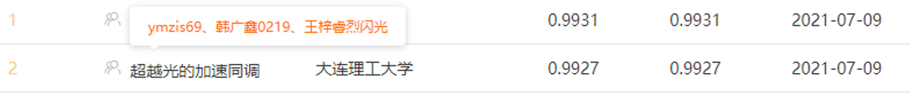
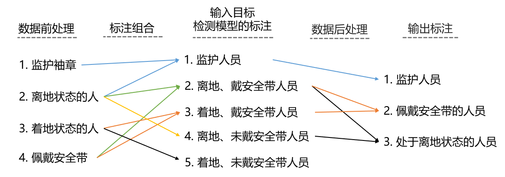

# 天池广东电网识别挑战赛（赛道三） 亚军方案分享

比赛网址：[天池广东电网识别挑战赛（赛道三）](https://tianchi.aliyun.com/competition/entrance/531899/introduction)

队伍名称：超越光的加速同调




## 文件存放路径

请按照[官方的要求](https://tianchi.aliyun.com/competition/entrance/531899/tab/276)存放训练文件路径：

```
|-- data

   |-- track_3

       |-- 3_images

       |-- 3train_rname.csv

       |-- 3_test_imagesa

       |-- 3_testa_user.csv

       |-- 3_testB

       |-- 3_testb_imageid.csv
```

产生的b榜预测结果存放路径为：

```
|-- prediction_result

   |-- result_b.json
```


## 代码环境及依赖

+ OS: Ubuntu18.04

+ GPU: Tesla V100 16G显存 * 1

+ python: python3.7

+ 深度学习框架：pytorch1.6.0

+ 电脑中基本环境nvidia环境信息:

  - cuda: 10.0

  - cudnn: 7.6.5

  - nvidia driver version: 460.73.01

    

### Python依赖项安装及编译


- **依赖安装编译**

  实验都是基于anaconda3中的虚拟环境进行的，请先安装anaconda3。
  
  在anaconda环境中，以下所有的命令都是在` code/ ` 路径下执行。

```
# 创建虚拟环境
conda create -n gddw python=3.7 -y

# 激活虚拟环境
conda activate gddw

# 安装 pytorch、torchvision、cudatoolkit
conda install pytorch==1.6.0 torchvision==0.7.0 cudatoolkit=10.2 -c pytorch

# 安装其他依赖项。安装mmpycocotools时会报一些警告，但能安装成功
pip install -r requirements.txt

# 安装 mmcv-full，务必安装大于1.3.5版本的mmcv-full，否则训练时会出现梯度爆炸的问题
pip install mmcv-full==1.3.7 -f https://download.openmmlab.com/mmcv/dist/cu102/torch1.6.0/index.html

# 编译 mmdetection
python setup.py develop
```


## 模型训练及推理

### **训练**

训练之前需要提前下载mmdetection官方开源的DetectoRS的COCO预训练模型[detectors_htc_r101_20e_coco_20210419_203638-348d533b.pth](https://download.openmmlab.com/mmdetection/v2.0/detectors/detectors_htc_r101_20e_coco/detectors_htc_r101_20e_coco_20210419_203638-348d533b.pth)并放置于 `code/pretrained/ `目录下，然后运行下列指令开始训练。

在anaconda环境中，以下所有的命令都是在` code/ ` 路径下执行。

```
# 激活虚拟环境
conda activate gddw

# 赋予训练脚本权限
chmod +x train.sh

# 运行训练脚本
bash train.sh
```

train.sh文件中的命令的功能如下：

```
# 将训练图片的csv文件标注转换成json标注格式
python data_process/2json_train.py

# 在第一块显卡进行训练
CUDA_VISIBLE_DEVICES=0 PORT=1111 ./tools/dist_train.sh configs/detectoRS_r101.py 1

# 将最终模型中多余的参数去掉
python data_process/model_dist.py
```


### **推理**

运行下列命令即可进行推理，已经训练完的模型存放路径为`user_data/model_data/epoch_12_dist.pth`。（如果您只需要测试，可以通过[百度云下载](https://pan.baidu.com/s/1atTqjpRrFKhRGoVDP5RLHg)（密码：isdo）已经训练完成的模型）

在anaconda环境中，以下所有的命令都是在` code/ ` 路径下执行。

```
# 激活虚拟环境
conda activate gddw

# 赋予推理脚本权限
chmod +x test.sh

# 运行推理脚本
bash test.sh
```

test.sh文件中的命令的功能如下：

```
# 将测试图片的csv转换成json标注格式
python data_process/testb2json.py

# 在第一块显卡进行推理
CUDA_VISIBLE_DEVICES=0 python ./tools/test.py ./configs/detectoRS_r101.py ../user_data/model_data/epoch_12_dist.pth --format-only
```


## 算法介绍

算法介绍包括了数据前处理、神经网络模型、检测结果后处理三个部分。基本流程为：

1. 使用数据前处理将图片的标注转换成需要的json文件标注格式；
2. 将图像和json标注文件送入深度网络模型进行训练，得到最终的检测网络模型；
3. 训练完成后，检测网络模型对测试集进行推理，得到检测结果后，对检测结果进行后处理，得到最终提交的json文件。




### 数据前处理

赛道三中提供的标注标签为：

1. badge：监护袖章（只识别红色袖章）
2. offground：离地状态的人
3. ground：着地状态的人
4. safebelt：佩戴安全带

需要检测的目标类别为：

1. guarder（监护人员）
2. safebeltperson （佩戴安全带人员）
3. offgroundperson（离地状态人员）

因为赛题提供的标签和需要检测的目标类别不一致，因此需要一定的组合处理。本算法的思路是在训练检测网络之前，先将提供的训练标注标签组合成以下类别，然后再送入网络进行训练。更多数据前处理的细节请看代码，位置为` code/data_process/2json_train.py `。

1. 监护人员（rg）

2. 离地、佩戴安全带的非监护人员（os）

3. 着地、佩戴安全带的非监护人员（gs）

4. 离地、未佩戴安全带的非监护人员（ons）

5. 着地、未佩戴安全带的非监护人员（gns）


具体的组合思路为：

1. ground标注框里面包含了badge标注，无论是否包含其他标注，都记为rightdressed的监护人员（rg）；
2. offground标注框里面不包含badge标注，并且（offground标注框与safebelt标注框重叠的区域面积/safebelt标注框的区域面积）>0.24，则记为离地、佩戴安全带的非监护人员（os）；
3. ground标注框里面不包含badge标注，并且（ground标注框与safebelt标注框重叠的区域面积/safebelt标注框的区域面积）>0.24，则记为着地、佩戴安全带的非监护人员（gs）；
4. offground标注框里面不包含badge标注，并且不满足（offground标注框与safebelt标注框重叠的区域面积/safebelt标注框的区域面积）>0.24的条件，则记为离地、未佩戴安全带的非监护人员（ons）；
5. ground标注框里面不包含badge标注，并且不满足（ground标注框与safebelt标注框重叠的区域面积/safebelt标注框的区域面积）>0.24的条件，则记为着地、未佩戴安全带的非监护人员（gns）。

因为训练标注框不一定完全准确，在判断ground或者offground标注框是否包含badge标注框时，允许ground或者offground标注框在4个方向扩大12个像素。


### 神经网络模型

采用的基本网络模型是基于DetectoRS_Resnet101的DetectoRS神经网络模型（单模型），基本网络架构是Cascade Rcnn，然后backbone替换为DetectoRS_Resnet101，FPN替换为RFP。

最终提交的模型中使用的数据增强方式为

1. 随机左右翻转
2. Auto augment V2
3. 多尺度训练/多尺度测试，训练时短边尺度为720-1080随机，测试时短边尺度为720、900、1080

训练参数为：batch_size设置为1；学习率设置为0.00125；训练12个轮次完成收敛。

测试参数为：选用的是soft_nms, 非极大值抑制的阀值为0.5，输出阀值为0.0001。

更多的配置参数请参考` code/configs/detectoRS_r101.py `文件。

#### 提交结果：

|                    |                 trick                  |               图像大小                |   结果记录（A榜/B榜）   |                             模型                             |
| :----------------: | :------------------------------------: | :-----------------------------------: | :---------------------: | :----------------------------------------------------------: |
|   **datectoRS**    | **label_smoothing+autoaugment_v2+BFP** | **(4096,720),(4096,900),(4096,1080)** | **0.9912(best)/0.9922** |                                                              |
| **datectoRS_r101** |   **label_smoothing+autoaugment_v2**   | **(4096,720),(4096,900),(4096,1080)** | **0.9910/0.9927(best)** | [**model**](https://pan.baidu.com/s/1atTqjpRrFKhRGoVDP5RLHg)(密码: isdo) |


### 检测结果后处理

得到5类检测结果后，按照赛题需要的检测结果生成json文件。

1. 监护人员（rg）输出标签为 1。
2. 离地、佩戴安全带的非监护人员（os）输出标签为 2、3。

3. 着地、佩戴安全带的非监护人员（gs）输出标签为 2。

4. 离地、未佩戴安全带的非监护人员（ons）输出标签为 3。

5. 着地、未佩戴安全带的非监护人员（gns）不进行输出。

生成json文件即是最后可以提交的json文件，具体的标签转换信息可以参考` code/mmdet/datasets/coco.py `文件（244行-281行）。


## 开源代码及预训练模型

1. 代码的主体部分基于开源的[mmdetection](https://github.com/open-mmlab/mmdetection)代码，V2.11.0版本

2. 数据增强部分参考了 [zhengye1995的开源代码](https://github.com/zhengye1995/kesci-2021-underwater-optics)

3. 预训练模型为mmdetection官方开源的DetectoRS的COCO预训练模型[detectors_htc_r101_20e_coco_20210419_203638-348d533b.pth](https://download.openmmlab.com/mmdetection/v2.0/detectors/detectors_htc_r101_20e_coco/detectors_htc_r101_20e_coco_20210419_203638-348d533b.pth)


## Contact

```
author：ymzis69

email：1750950070@qq.com
```

